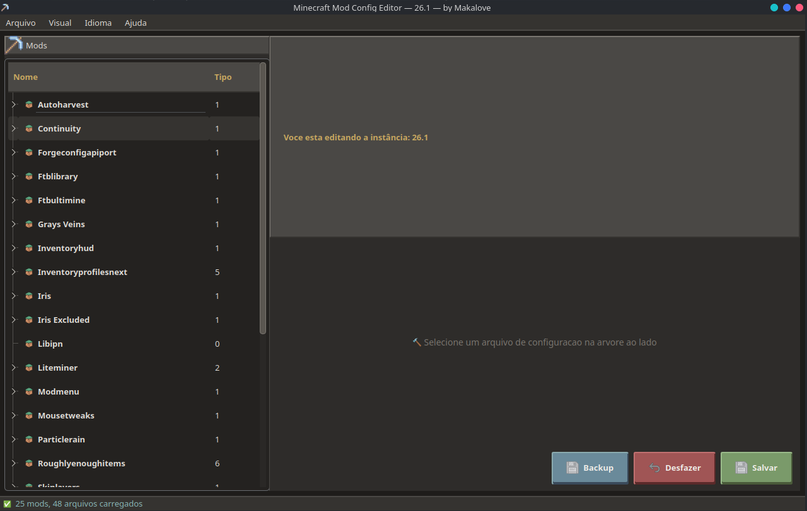
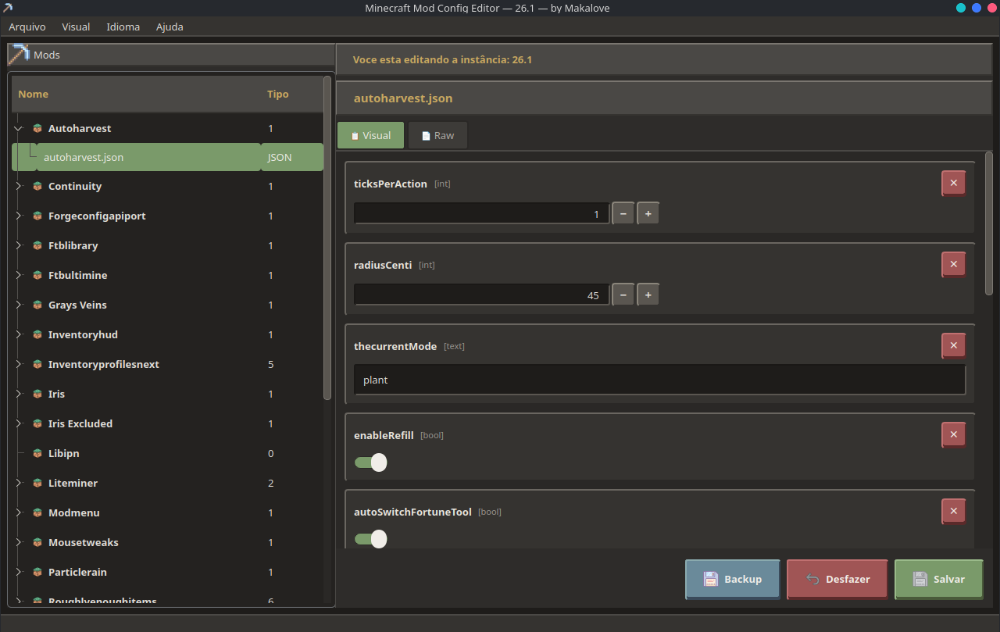
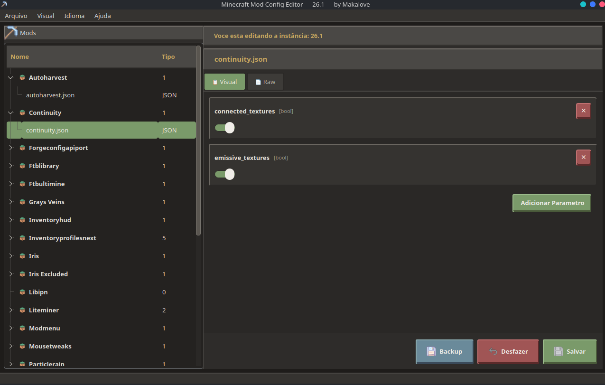
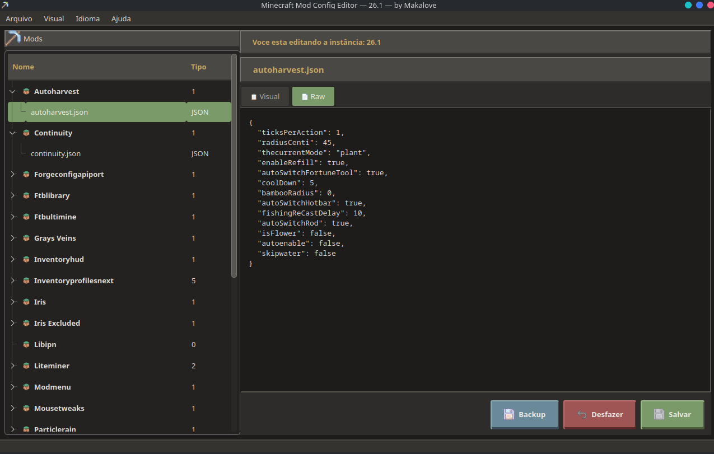

# ⛏ Minecraft Mod Config Editor — by Makalove

Cross-platform visual editor for Minecraft mod configuration files.  
Works with any Minecraft instance (vanilla, Forge, Fabric, PrismLauncher, ElyPrismLauncher and other launchers).


---

## 📸 Screenshots

<details open>
<summary><b>Click to expand/collapse</b></summary>
<br>
<br>
<br>
<br>

</details>

---

## 📋 Features

- **Visual editor** with styled cards for each parameter (TOML, JSON, JSON5, YAML)
- **Raw Editor** with `Visual | Raw` tabs for legacy formats (CFG, Properties, TXT, SNBT, INI)
- **Custom Toggle Switch** for booleans (replaces checkbox)
- **Numeric fields** with visible +/− buttons
- **Expandable tree** of mods → files with highlighted selection
- **Collapsible sections** with ▶/▼ indicator and `[Click to expand]` hint
- **Add/remove parameters** via the interface
- **Automatic backup** with timestamp before each save
- **Last instance remembered** — reopens where you left off
- **100% customizable via CSS** — edit `style/default.css` or create `style/custom.css`
- **PNG icons** (30×30) with automatic emoji fallback
- **Automatic dependency installation** when opening the app

---

## ⬇️ Quick download (standalone)

Download the ready-to-run executable for your system — **no Python or pip needed**.

👉 **[GitHub Releases](https://github.com/Adiog0/mc-mod-config/releases)**

| System | File |
|---|---|
| 🐧 Linux | `mc-config-editor` |
| 🪟 Windows | `mc-config-editor.exe` |
| 🍎 macOS | `mc-config-editor-macos` |

> **Linux**: give execute permission — `chmod +x mc-config-editor`  
> **macOS**: after downloading, run `xattr -cr mc-config-editor-macos` (Gatekeeper)

---

## 🚀 How to use

### Standalone (recommended)
```bash
./mc-config-editor                        # instance selector
./mc-config-editor -i "path/to/instance"  # direct
```
On Windows, rename `mc-config-editor.exe` or run directly:
```cmd
mc-config-editor.exe
mc-config-editor.exe -i "C:\path\to\instance"
```

### Linux / macOS (source)
```bash
cd mc-mod-config
./mc-config-editor                        # instance selector
./mc-config-editor -i "path/to/instance"  # direct
```

### Windows (source)
```cmd
cd mc-mod-config
mc-config-editor.bat                      # instance selector
python mc-config-editor.py -i "C:\path\to\instance"
```

### Direct Python (any OS)
```bash
pip install PyQt6 tomlkit pyjson5 pyyaml
python mc-config-editor.py
```

> If any dependency is missing, the app asks whether you want to install it automatically.

---

## 📦 Dependencies

| Package | Use |
|---|---|
| **PyQt6** >= 6.0 | Graphical interface |
| **tomlkit** | Read/write TOML preserving comments |
| **pyjson5** | Read/write JSON5 |
| **pyyaml** | Read/write YAML |

One-time installation:
```bash
pip install PyQt6 tomlkit pyjson5 pyyaml
```

---

## 🔧 Build from source

To generate your own standalone executable:

```bash
# Install build dependencies
pip install pyinstaller PyQt6 tomlkit pyjson5 pyyaml

# Build
./build/build.sh            # Linux/macOS
build\build.bat             # Windows

# Or directly with PyInstaller:
pyinstaller build/build.spec
```

> The executable is placed in `dist/mc-config-editor` (or `.exe` on Windows).  
> The binary already includes icons, CSS, translations (.qm) and all Python dependencies — **zero extra installation**.

### Automated build (CI/CD)

When creating a **release** on GitHub (`v*.*.*`), a GitHub Actions workflow automatically compiles for Linux, Windows, and macOS and attaches the binaries to the release.

---

## 🎨 Themes and CSS

The app is **100% controlled by CSS** (QSS — Qt Style Sheets).  
Zero hardcoded colors in Python code.

### Changing the theme
```bash
cp style/example.css style/custom.css   # create from template
# Edit style/custom.css with your colors
```

### Ready-made palettes (in `style/example.css`)
- **Night Blue** — dark blue tones
- **Forest Green** — moss green
- **Minimalist Gray** — clean and neutral

### View Menu
- `View → Load Custom CSS` — selects any `.css` file  
- `View → Reset Default CSS` — returns to the original theme

---

## 🖼️ Icons

Icons are loaded from the `icons/` folder as **PNG** files (transparent background).  
If an icon does not exist, the app uses the corresponding emoji as fallback.

| File | Size | Description |
|---|---|---|
| `pickaxe.png` | 30×30 | App icon |
| `castle.png` | 30×30 | Current instance |
| `folder.png` | 22×22 | Open instance |
| `refresh.png` | 22×22 | Reload |
| `palette.png` | 22×22 | Load CSS |
| `save.png` | 22×22 | Save / Backup |
| `undo.png` | 22×22 | Cancel |
| `block.png` | 16×16 | Mods in the tree |
| `settings.png` | 16×16 | TOML files |
| `crafting.png` | 16×16 | JSON files |
| `scroll.png` | 16×16 | YAML files |
| `file.png` | 16×16 | Other formats |
| `add.png` | 22×22 | Add parameter |
| `delete.png` | 22×22 | Delete parameter |

---

## 🗂️ Project structure

```
mc-mod-config/
├── mc-config-editor          ← Linux/macOS launcher
├── mc-config-editor-qt       ← alternative launcher
├── mc-config-editor.bat      ← Windows launcher
├── mc-config-editor.py       ← entry point
├── mc-config-editor-qt.py    ← main application (PyQt6)
├── build/                    ← PyInstaller build config
│   ├── build.spec            ←   PyInstaller spec
│   ├── build.sh              ←   Linux/macOS build script
│   ├── build.bat             ←   Windows build script
│   ├── generate-icns.sh      ←   .icns generator (macOS)
│   └── mc-config-editor.ico  ←   Windows icon
├── i18n/                     ← translation files (.ts / .qm)
├── icons/                    ← PNG icons
├── style/                    ← CSS themes
└── Screenshots/              ← screenshots
```

---

## 🔒 Security

- **Single network call** — the app queries the GitHub API only to check for updates (silent, non-blocking)
- **Zero data collection** — no telemetry or analytics
- Configuration files are read/written **locally only**

---

## 🧪 Supported formats

| Format | Editor | Preserves comments |
|---|---|---|
| `.toml` | Visual (typed fields) | ✅ Yes (via tomlkit) |
| `.json` | Visual (typed fields) | ❌ |
| `.json5` | Visual (typed fields) | ❌ |
| `.yaml` / `.yml` | Visual (typed fields) | ✅ Yes |
| `.cfg` | Visual (typed fields) | ❌ |
| `.properties` | Visual (typed fields) | ❌ |
| `.txt` | Visual (typed fields) | ❌ |
| `.snbt` | Visual (text editor) | ❌ |
| `.ini` | Visual (typed fields) | ❌ |

---

## 📝 Notes

- The app has been tested with vanilla Minecraft, Forge, Fabric, **PrismLauncher** and **ElyPrismLauncher**
- The expected directory structure is: `instance/minecraft/config/`
- Backups are created as `file.bak.YYYYMMDD_HHMMSS` in the same directory
- For development, use the `hml` branch (staging). The `main` branch is production

---

**Made with 💛 by Makalove**

> 📖 Also available in: [Português](README.md) | [Español](README_ES.md)
